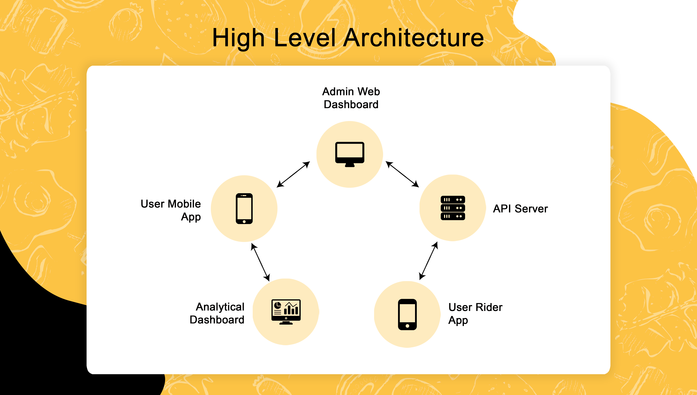

# E-commerce food delivery

<b>This is the full free source code of our solution, however the backend and API is proprietary and can be obtained via paid license.</b>

## What is included:

Our solution contains three separate modules. These include the admin panel, the delivery app and the rider app. Below, the capabilities of all three modules have been listed:

- The admin panel receives the orders that can be placed via the customer app. It also allows managing the restaurant’s orders as well as the riders’ accounts.

- The customer app allows for customers to choose their specific selections and customize their order before placing it.

- The rider app can accept the orders and also allows for location based zoning as well as the ability to locate customer’s address via google map’s API integration.

## Features:

- Analytics dashboard for the mobile app
- Payment integration with Paypal and Stripe
- Order tracking feature
- Email Integration e.g for order confirmation etc.
- Ability to provide ratings and reviews
- Finding address using GPS integration
- Facebook and Google authentication integration
- Mobile responsive dashboard
- Multi-Language support using localization
- Separate rider app for order management
- Multiple variations of food items
- Push notifications for both mobile and web

## High Level Architecture

- User Mobile App communicates with both API Server and [Amplitudes](https://amplitude.com/) analytics dashboard
- Web dashboard communicates with only API Server
- Rider App communicates with API Server

### Prerequisites:

##### App Ids for Mobile App in app.json

- Facebook Scheme
- Facebook App Id
- Facebook Display Name
- iOS Client Id Google
- Android Id Google
- Amplitude Api Key
- server url

##### Set credentials in API in file helpers/config.js and helpers/credentials.js

- Email User Name
- Password For Email
- Mongo User
- Mongo Password
- Mongo DB Name
- Reset Password Link
- Admin User name
- Admin Password
- User Id
- Name

##### Set credentials in Admin Dashboard in file src/index.js

- Firebase Api Key
- Auth Domain
- Database Url
- Project Id
- Storage Buck
- Messaging Sender Id
- App Id

##### NOTE: Email provider has been only been tested for gmail accounts

## Technologies:

- [Expo](https://expo.dev/)
- [React Navigation](https://reactnavigation.org/)
- [Apollo GraphQL](https://www.apollographql.com/)
- [ReactJS](https://reactjs.org/)
- [NodeJS](https://nodejs.org/en/)
- [MongoDB](https://www.mongodb.com/)
- [Firebase](https://firebase.google.com/)
- [Amplitude](https://amplitude.com/)
- [React Native](https://reactnative.dev/)
- [React Router](https://reactrouter.com/)
- [GraphQL](https://graphql.org/)
- [ExpressJS](https://expressjs.com/)
- [React Strap](https://reactstrap.github.io/)

The frontend source code for our solution is completely open source. However, the API and backend is proprietary and can be accessed via a paid license. For further information, contact us on the channels provided below.

## Contact Us:

sales@ninjascode.com
